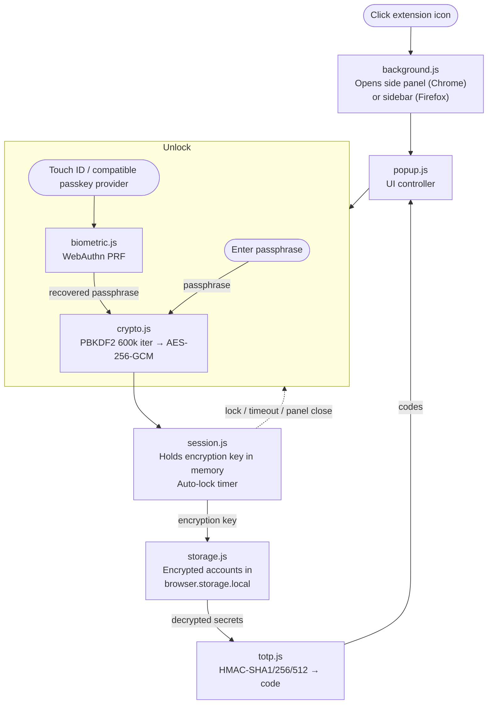

# Technical reference

This document collects the implementation, security-review and development details for [Digital Habits: Phone-Free 2FA](../README.md). The main README is written for users and organisations considering deployment.

## Security model

| Layer | Implementation |
|-------|---------------|
| Encryption | AES-256-GCM (Web Crypto API) |
| Key derivation | PBKDF2 · 600,000 iterations · SHA-256 |
| Passphrase verification | Constant-time XOR comparison of derived hashes |
| Biometric key wrapping | WebAuthn PRF → HKDF → AES-256-GCM (as strong as the passkey provider) |
| TOTP generation | HMAC-SHA1/256/512 (Web Crypto API), RFC 6238 |
| Network access | None — no host permissions, and blocked by the browser via CSP `connect-src 'none'` |
| Storage | `browser.storage.local` only |
| Runtime dependencies | Zero (no build step, bundler or minified blobs; every shipped file is readable source) |

### Security properties

- **Local only:** the extension never makes network requests. The browser enforces this through the manifest's Content Security Policy.
- **Minimal permissions:** it requests only `storage` and `sidePanel`, with no host permissions or remote code.
- **Encrypted vault:** all account data is encrypted at rest and decrypted only while unlocked.
- **Passphrase handling:** the master passphrase is never stored; only a derived verification token is persisted.
- **Memory clearing:** the encryption key, decrypted TOTP secrets and in-flight modal inputs are cleared on lock or when the side panel closes.
- **Automatic locking:** users can choose an inactivity timeout of 1, 5, 15 or 30 minutes, or disable the inactivity timer. Closing the panel clears the key immediately.
- **Failed-attempt delays:** progressive cooldowns of 5 seconds, 30 seconds and 5 minutes are persisted across panel restarts. This deters guessing through the UI, but does not prevent an attacker with disk access from copying the encrypted vault for an offline attack. Passphrase strength remains the primary defence.
- **Clipboard clearing:** copied codes are removed from the clipboard after 30 seconds.
- **Passphrase checks:** new passphrases are checked for common-password substrings, keyboard walks, repeating patterns and low character diversity.
- **No secrets in the DOM:** TOTP secrets remain in memory and are never written to HTML attributes.

### Biometric unlock

Biometric unlock uses the WebAuthn PRF extension. The master passphrase is encrypted with a key derived from the passkey through WebAuthn PRF, HKDF and AES-256-GCM; that key is not stored by the extension.

The security of biometric unlock therefore depends on the selected passkey provider. With Chrome's built-in authenticator on macOS, the passkey remains in the device's security hardware. A syncing provider such as Google Password Manager, iCloud Keychain or 1Password syncs it under that provider's end-to-end encryption.

Windows Hello does not currently support the WebAuthn PRF extension required by this implementation. Windows users must choose a compatible provider such as Google Password Manager or 1Password. Firefox does not currently allow the WebAuthn Credentials API from extension origins, so biometric unlock is unavailable there; see [Mozilla bug 1462088](https://bugzilla.mozilla.org/show_bug.cgi?id=1462088).

Changing the master passphrase clears the stored biometric configuration.

## Runtime flow

1. On first launch, the user creates a master passphrase of at least 12 characters.
2. PBKDF2 derives a 256-bit encryption key from the passphrase.
3. AES-256-GCM encrypts the account data stored in `browser.storage.local`.
4. Unlocking derives the key again and holds it in memory for the session.
5. The extension generates TOTP codes using HMAC-SHA1/256/512 as specified by RFC 6238.
6. Manual lock, automatic lock or closing the panel clears the key from memory.



## Technology

- Vanilla JavaScript using ES modules, without transpilation
- Vanilla CSS with light and dark themes
- Web Crypto API for cryptographic operations
- Custom RFC 6238 / RFC 4226 TOTP implementation
- Minimal browser API shim, without `webextension-polyfill`
- Manifest V3

## Project structure

```text
src/
├── manifest.json           # Extension manifest (MV3)
├── popup.html              # Main sidebar UI
├── popup.css               # Light and dark themes
├── popup.js                # UI controller and TOTP refresh
├── background.js           # Opens the side panel or sidebar
├── crypto.js               # AES-GCM encryption and PBKDF2
├── totp.js                 # Base32, HMAC and RFC 6238
├── storage.js              # Encrypted storage and backup fingerprinting
├── backup.js               # Encrypted backup format
├── accounts.js             # Account editing and import validation
├── lock-policy.js          # Lock-on-hide policy
├── session.js              # In-memory session and automatic lock
├── biometric.js            # WebAuthn PRF integration
├── biometric-tab.html      # Dedicated tab for WebAuthn prompts
├── biometric-tab.js        # Biometric-tab controller
├── browser.js              # Minimal browser API shim
├── passphrase-strength.js  # Passphrase policy and checks
├── step1-3.png             # In-app setup images
└── icons/                  # Extension icons

tests/                      # Node test suite; never shipped
tools/build-zip.sh          # Reproducible release archive
tools/publish/              # Store publisher; release-time only
```

## Loading from source

There is no build step. The extension runs as vanilla ES modules, and every shipped file is intended to be human-readable.

### Chrome and Edge

1. Open `chrome://extensions` or `edge://extensions`.
2. Enable **Developer mode**.
3. Select **Load unpacked**.
4. Select the `src/` directory.

### Firefox

1. Open `about:debugging#/runtime/this-firefox`.
2. Select **Load Temporary Add-on**.
3. Select `src/manifest.json`.

## Tests

The project uses Node's built-in test runner and has no development dependencies. Run it with Node 22 or newer:

```bash
node --test
```

The test suite covers RFC 6238 vectors, backup round trips for supported algorithms, digit counts and periods, injected storage failures during passphrase changes, concurrent vault writes, lock-on-hide rules and UI races using a small fake DOM. Manifest guard tests fail if a permission is added or the Content Security Policy is weakened.

Checks requiring real browsers are recorded in the [manual test checklist](manual-test-checklist.md).

## Release verification

The archive attached to each [GitHub release](https://github.com/digitalhabits/phone-free-2fa/releases) is the exact file submitted to the browser stores. Its release notes include the SHA-256 digest.

To reproduce an archive, check out its tag and run:

```bash
tools/build-zip.sh
```

The same commit produces the same bytes. Store submission happens in a separate, approval-gated job that installs its publishing tool from a committed lockfile with install scripts disabled; see [`.github/workflows/release.yml`](../.github/workflows/release.yml).

## Auditability

Every shipped file is plain source: there is no bundler, minification, build step or vendored third-party code.

The passphrase-strength implementation is approximately 190 lines of commented JavaScript. It checks for `"password"` substrings, including common substitutions; exact matches against a ten-entry constant derived from the SecLists top-10,000 list after filtering for strings of at least 12 characters; keyboard walks; repeating patterns; and a minimum number of unique characters. The derivation of the constant is documented inline in [`src/passphrase-strength.js`](../src/passphrase-strength.js) with a command an auditor can use to reproduce it.
